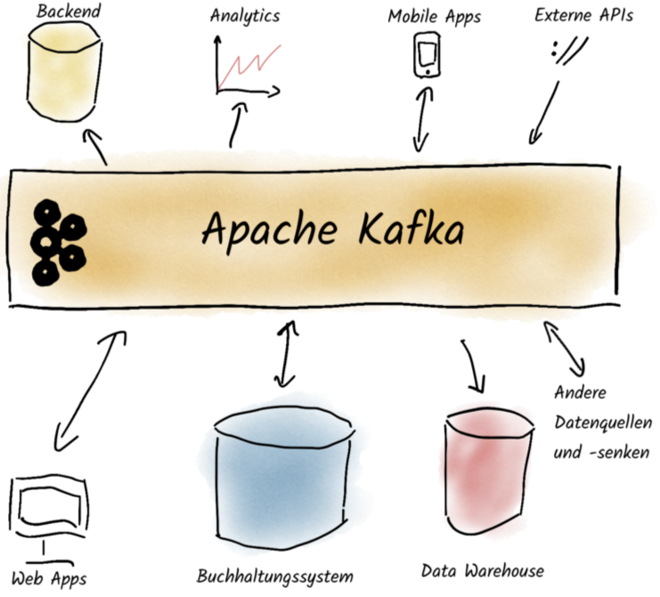

_Apache Kafka_ wurde initial von _LinkedIn_ entwickelt, dessen Quellcode 2011 offengelegt wurde. Die open-source Software wird seitdem von der _Apache Software Foundation_ gewartet und weiterentwickelt.

Bei _Kafka_ handelt es sich um ein Log-basiertes _Stream-Processing-Framework_. Wichtige Eigenschaften sind unter anderem die Verteilung über mehrere Hostsysteme inklusive redundanter Speicherung und Partitionierung, die Skalierbarkeit, die Fehlertoleranz, die Zuverlässigkeit sowie eine hohe Performance [1]. Ein Beispiel dafür ist der Einsatz von _Kafka_ bei _LinkedIn_ selbst [1]:

-   175TB Daten
-   ca. 1,5ms Latenz
-   7 Millionen Schreiboperationen pro Sekunde
-   35 Millionen Leseoperationen pro Sekunde

Der entscheidende Unterschied zu anderen _Streaming-Systemen_, wie _Apache Spark Streaming_, ist allerdings ein anderer. Nachdem eine Nachricht in einem _Kafka-System_ abgerufen wird, wird diese nicht direkt verworfen. Stattdessen werden alle _Events_ beziehungsweise Nachrichten persistiert, sodass diese sich ähnlich zu einer klassischen Datenbank auch nach Monaten abrufen lassen. Deshalb setzen zunehmend mehr Unternehmen _Apache Kafka_ nicht nur als _Streaming-Plattform_, sondern als zentralen Datenumschlagplatz ein [2]. Die folgende Grafik verdeutlicht die Einbindung in einen typischen _Business-Usecase_, in dem Backend, Analysetools, eine mobile Anwendung, das Buchhaltungssystem sowie viele weitere Bestandteile der Infrastruktur Daten über Apache Kafka austauschen und als zentrales Nervensystem verwenden.

Eine typische Kafka Umgebung, auf die viele Services eines Businesses zugreifen, um Daten zu lesen oder hinzuzufügen. [2]

