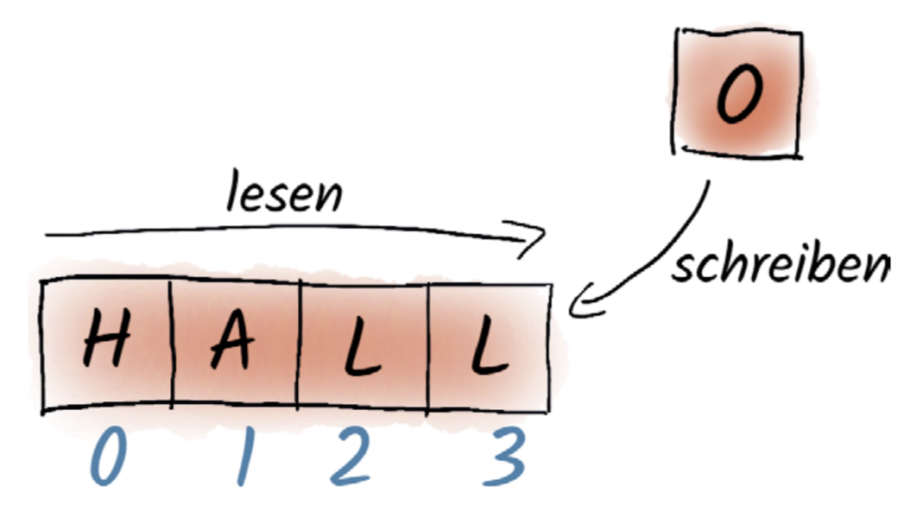
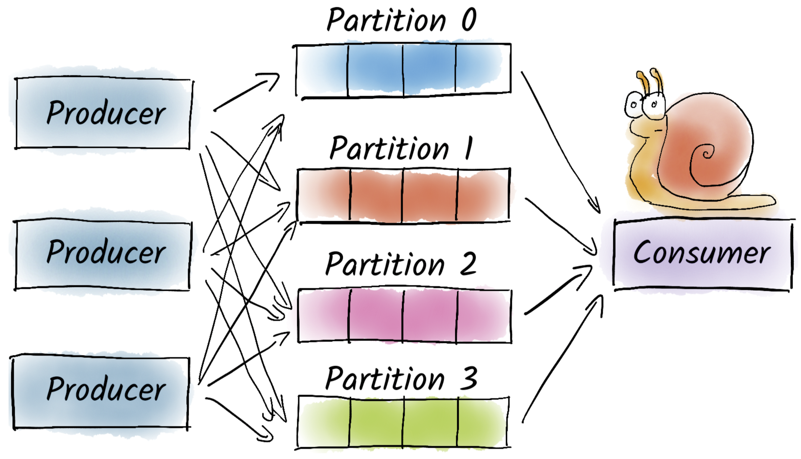
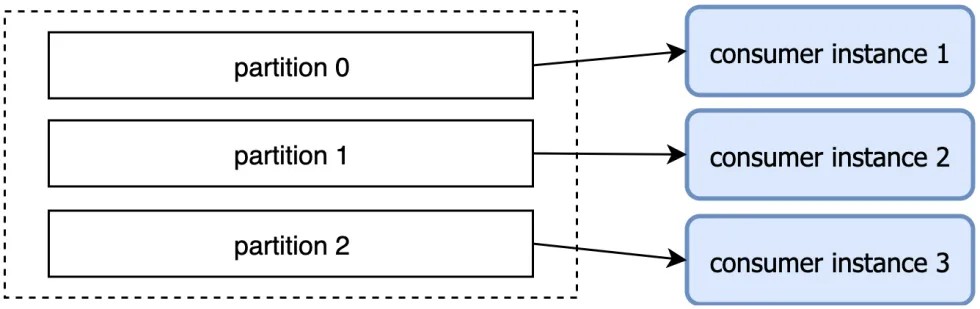

# Topics

Nachrichten werden in _Apache Kafka_ in _Topics_ organisiert. Ein _Topic_ wird dabei in der Regel nach der semantischen Bedeutung der darin enthaltenen Nachrichten benannt [4], beispielsweise "Aktienkurse".

# Partitionen

Ein _Topic_ besteht aus einer oder mehreren _Partitionen_. In der Einführung wurde bereits über ein "Log-basiertes _Stream-Processing-Framework_" gesprochen. Diese Analogie kommt jetzt zum Tragen, da die Datenstruktur der _Partitionen_ ähnlich aufgebaut ist. Wie bei Logs werden nämlich neue Nachrichten in einer _append-only_ Weise immer in der Reihenfolge, wie die Nachrichten eintreffen, an die _Partition_ angehängt. Bestehende Einträge werden weder editiert noch gelöscht [4].

_Partitionen_ in _Topis_ lassen sich auch verwenden, um Untergruppen zu bilden. So können Beispielsweise Daten zu einem bestimmten Aktienkurs in einer eigenen Partition gehandhabt werden.

Visualisierung Partition [2].

# Producer

_Producer_ werden die Teilenehmer in einem System genannt, die neue Nachrichten in das System einspeisen. Diese Nachrichten werden dann, wie in der untenstehenden Abbildung, in dem _Topic_ beziehungsweise dessen _Partitionen_ persistiert [2].

# Consumer

Wie der Name suggeriert, konsumieren beziehungsweise verarbeiten _Consumer_ neue Nachrichten eines _Topics_. Wird allerdings ein _Consumer_ auf alle _Partitionen_ eines _Topics_ angesetzt, kann dies schnell zu einem Flaschenhals führen, da die Gesamtheit der _Producer_ ein zu hohes Nachrichtenaufkommen für einen einzigen _Consumer_ generieren kann [4]. Wichtig anzumerken ist, dass die _Producer_ aufgrund der Natur von _Messaging-Systemen_ weiterhin in eigener Geschwindigkeit senden können, der _Consumer_ allerdings immer weiter vom Ist-Zustand abgehängt wird.

Verhältnis zwischen <i>Producer</i>, Partitionen und <i>Consumer</i> [2].

Infolgedessen ist es möglich und sinnvoll mehrere _Consumer_ für verschiedene _Partitionen_, wie in der folgenden Grafik abgebildet, zu verwenden. Dies beugt den beschrieben Flaschenhals vor, da nicht ein einziger _Consumer_ alle Nachrichten verarbeiten muss.

Partitionen zur Parallelisierung [4].

