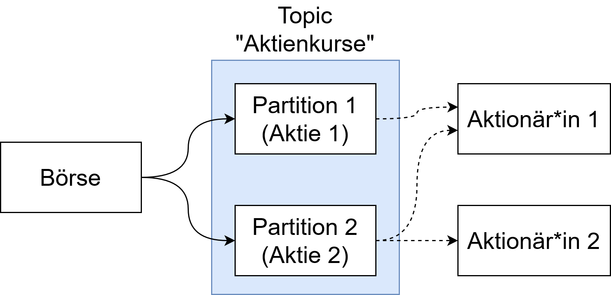

Der Wert von Aktien schwankt ständig. Es ist wichtig, dass Aktionär\*innen über die neusten Preisentwicklungen der Kurse verfügen, dass heißt in Echtzeit Änderungen erhalten.

Wie aus der Abbildung zu erkennen, wird dazu das _Topic_ "Aktienkurse" verwendet, in dem verschiedene _Partitionen_ enthalten sind. Eine _Partition_ repräsentiert jeweils eine Aktie. Sobald die Kurse sich ändern, sendet die Börse (_Producer_) das entsprechende Preisupdate an das _Topic_ beziehungsweise die _Partition_. In diesem Fall werden die Aktienkurse in separaten _Partitionen_ gespeichert, um die Kursentwicklungen sicher einer Entität zuschreiben zu können. Als Seiteneffekt geht dies auch zu Gunsten der Performance, wie in dem Kapitel "Funktionsweise" beschrieben. Die Aktionär\*innen abonnieren dann entsprechend die _Partitionen_, die die gewünschten Aktien repräsentieren.

Datenstrom des Aktienprojektes.

Dieser _Use-Case_ wird im folgenden umgesetzt.
